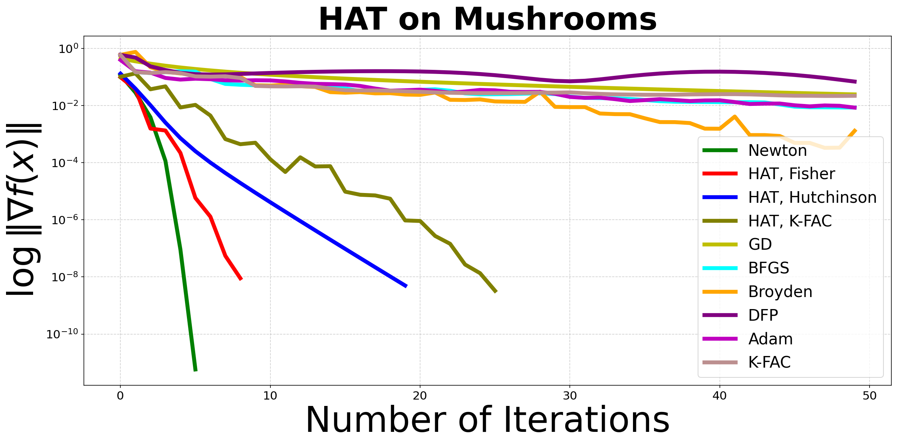

As requested by **Reviewer GU5n**, we provide a new results on DNNs verifying the properties of relative inexactness for Quasi-Newton methonds and including rank-1 approximations of the Hessian:

As requested by **Reviewers x5kM and LmpF**, we provide new results on the nonconvex problem comparing our HAT method with different popular methods in the field:

As requested by **Reviewer GU5n**, we provide a new results regarding the comparison of the HAT method with more methods. In this revision we have included BFGS, Broyden and DFP, as well as Adam and K-FAC.
Moreover, we show that our HAT with K-FAC approximation works remarkably better than K-FAC itself on the problems that are easily tractable by classical secon-order methods. We present our result as follows:

(small comment: we have tuned some methods, e.g., BFGS, more carefully  than in the original report)

In addition, we report a comparison of the same method on non-linear least squares loss, where as a non-linear model we use tanh(x @ w)

